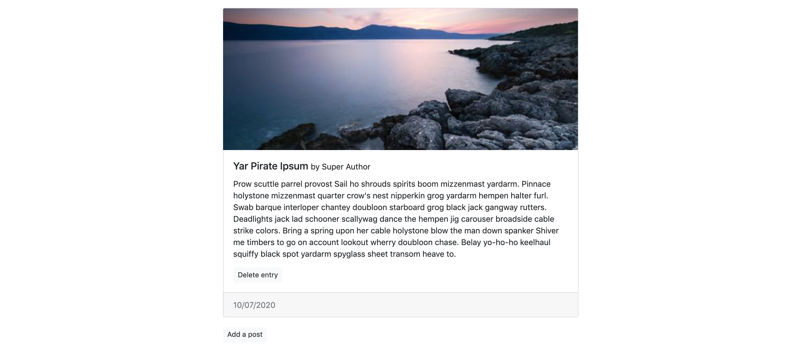
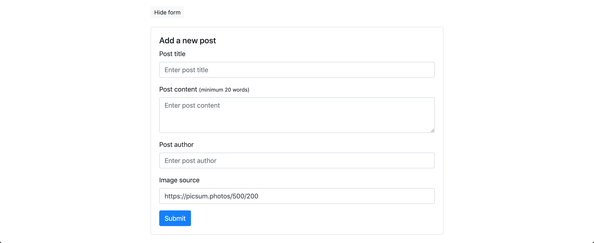

# Weekend project 2 (11/07/20)

## Here's your weekend challenge : create a BETTER blog!

SO! We're going to build something very similar to what we did last weekend, but with more features, and new challenges 😎

The idea is still to create a blog, with a post list and a form to add a new post.

_The post and the add a post button_

_The form_

A few things :

-   A blog post will consist of a title, an author, a content body, an image (500 x 200), a date on the footer, and a delete button as a bonus.
-   The latest post will appear on top of the post list.
-   The button "Hide form" will hide the form. When the form is hidden, the text of the button is going to be "Add a post". And, when clicked again, the button will come back to the starting state ("Hide form" as the button text, and the form visible on the screen). There is a class of _.hidden_ that you can reuse. To hide the form, you can hide the element with the id _#form-card_.
-   Every element in the form is required.
-   The post content will consist of minimum 20 words. If the user enters less than that, add the class _.is-invalid_ to the _postContent_ textarea, and make the div with the class _.invalid-feedback_ appear in the DOM.
-   The date in the footer of the post will be automatically generated and set to _today_ during the post creation. You can do this with the Date class in javascript. I'll let you research this on the internet 😉
-   For the image, I put a picsum picture as default, but feel free to change it to something else.
-   BONUS : the delete button will delete the post from the DOM. This part here is a little bit more tricky than the examples we saw together. Try your best!

_example of invalid form_

As usual :

-   Fork this repo, and then clone **your fork** on your local machine.
-   Divide the problem into smaller problems, and solve them one at a time.
-   You can modify the HTML as you want, but it should not be necessary.
-   Code your solution into the script.js file

Happy coding ✨
